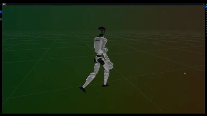
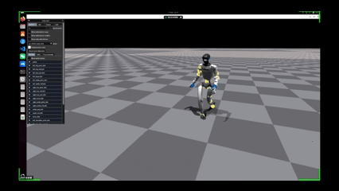
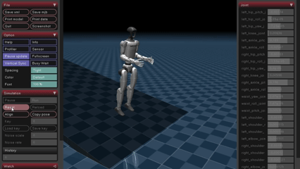

# Safe Falling for Humanoid Robots Via Motion-Mimic RL

This repository simulates and trains the G1 humanoid robot for safe falling behavior using MuJoCo and MHPPO based on the framework of [PBHC](https://github.com/TeleHuman/PBHC).

## Contents

- [Environment Setup](#environment-setup)
- [Project Structure](#project-structure)
- [Network Demo Running](#netowrk-demo-running)
- [Gym Demo Running](#gym-demo-running)
- [Policy Training](#policy-training)
- [Results of safe forward falling motion](#results-of-safe-forward-falling-motion)
- [Results of walking motion](#results-of-walking-motion)

## Environment Setup

Run the following command to set up the conda environment.

```bash
conda env create -f environment.yml
conda activate humanoid-safe-fall

# Install and test isaacgym
wget https://developer.nvidia.com/isaac-gym-preview-4
tar -xvzf isaac-gym-preview-4
pip install -e isaacgym/python

# Install PBHC
pip install -e .
pip install -e humanoidverse/isaac_utils
```

## Project Structure
- `description`: providing description files for the G1 humanoid robot. Detailed information can be found in `description\robots\g1\g1_23dof_lock_wrist.xml`. Three terrain configurations (flat, ramp, stair) are defined in  `description\robots\g1\g1_23dof_lock_wrist_<TERRAIN>.xml`.
- `motion_source`: tools for extracting SMPL format data from videos.
- `smpl_retarget`: tools for retargeting SMPL format motinos to the G1 humanoid robot.
- `robot_motion_process`: visualization tools for robot format motion.
- `humanoidverse`: training RL policy.
- `video_files`: Storing the walking video, processed motion files, training outputs, and terrain visualizations for setting up the safe falling environment.
- `training_outputs`: Storing the walking policy and corresponding model files after 35,000 training iterations.

Note: Other folders are not used in the current stage.

## Network Demo Running

This command will run training task with 5 iteration for demo.
```bash
chmod +x demo_Network.sh
./demo_Network.sh
```

## Gym Demo Running

This command will run the trained walking policy with the visualization in IssacGym. 
```bash
chmod +x demo_Gym.sh
./demo_Gym.sh
```

We define three types of terrain for safe falling environment. The following command can be run to visualize the real-time simulation of the robot's falling initialization. 

```bash
# a flat plane
python .\robot_motion_process\vis_q_mj.py +terrain=flat

# a ramp
python .\robot_motion_process\vis_q_mj.py +terrain=ramp

# a staircase
python .\robot_motion_process\vis_q_mj.py +terrain=stair
```

A quick preview is also provided in the `.gif` files in section 
[Environment Visualization for Safe Falling](#environment-visualization-for-safe-falling)

## Policy Training

Replace the MOTION_FILE_PATH in the command with the path to the target motion file.
We set 35,000 iterations for walking policy training.
```bash
python humanoidverse/train_agent.py \
+simulator=isaacgym +exp=motion_tracking +terrain=terrain_locomotion_plane \
project_name=MotionTracking num_envs=128 \
+obs=motion_tracking/main \
+robot=g1/g1_23dof_lock_wrist \
+domain_rand=main \
+rewards=motion_tracking/main \
experiment_name=debug \
robot.motion.motion_file=<MOTION_FILE_PATH> \
seed=1 \
+device=cuda:0
```

## Results of safe forward falling motion

## Results of walking motion

### Raw walking video


### Extracted SMPL motions


### Retargeted G1 humanoid robot performance


### Train Result after 35,000 iterations
Result A: the robot successfully walks 3 steps.



Result B: the robot manages to walk only 1 step before losing balance.


## Environment Visualization for Safe Falling

### Humanoid robot on a flat plane


### Humanoid robot on a ramp


### Humanoid robot on a staircase

