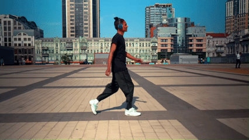
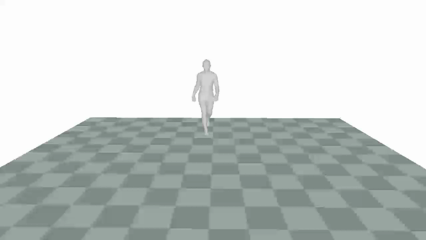
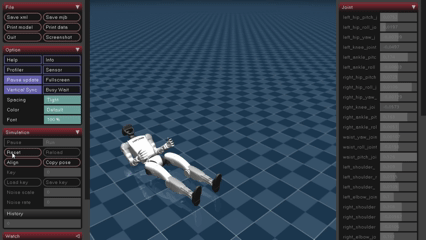
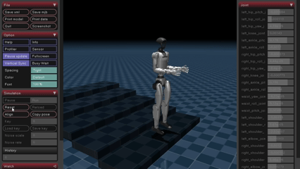

# Safe Falling for Humanoid Robots Via Motion-Mimic RL

This repository simulates and trains the g1 humanoid robot for walking test behaviors using MuJoCo and PPO before safe falling research.

## Environment Setup

```bash
conda env create -f environment.yml
conda activate humanoid-safe-fall
```

## Project Structure
- `description`: provide description file for G1 robot. Detail information can refer `description\robots\g1\g1_23dof_lock_wrist.xml`. 3 types of terrain settings can refer `description\robots\g1\g1_23dof_lock_wrist_<TERRAIN>.xml`.
- `motion_source`: tools for getting SMPL format data from videos.
- `smpl_retarget`: tools for SMPL to G1 robot retargeting.
- `smpl_vis`: tools for visualizing SMPL format data.
- `robot_motion_process`: tools for processing robot format motion. Including visualization, interpolation, and trajectory analysis.
- `humanoidverse`: training RL policy
- `example`: Demo motion file

## Policy Training

Change the `<MOTION_FILE_PATH>` in the command to target motion.
We set 35000 iterations for walk training.
```bash
python humanoidverse/train_agent.py \
+simulator=isaacgym +exp=motion_tracking +terrain=terrain_locomotion_plane \
project_name=MotionTracking num_envs=128 \
+obs=motion_tracking/main \
+robot=g1/g1_23dof_lock_wrist \
+domain_rand=main \
+rewards=motion_tracking/main \
experiment_name=debug \
robot.motion.motion_file=<MOTION_FILE_PATH> \
seed=1 \
+device=cuda:0
```

## Demo Running

Change the `<PT_FILE_PATH>` in the command to transfer `.pt` file into `.onnx` file.
```bash
python humanoidverse/eval_agent.py \
+device=cuda:0 \
+env.config.enforce_randomize_motion_start_eval=False \
+checkpoint=<PT_FILE_PATH>
```
Change the `<ONNX_FILE_PATH>` in the command to deploy the walking policy in MuJoCo.
```bash
python humanoidverse/urci.py \
+opt=record +simulator=mujoco \
+checkpoint=<ONNX_FILE_PATH>
```

## Result

Raw walking video


Extracted SMPL motions


pkl


pt

Humanoid robot in flat plane


Humanoid robot in ramp


Humanoid robot in stairs

